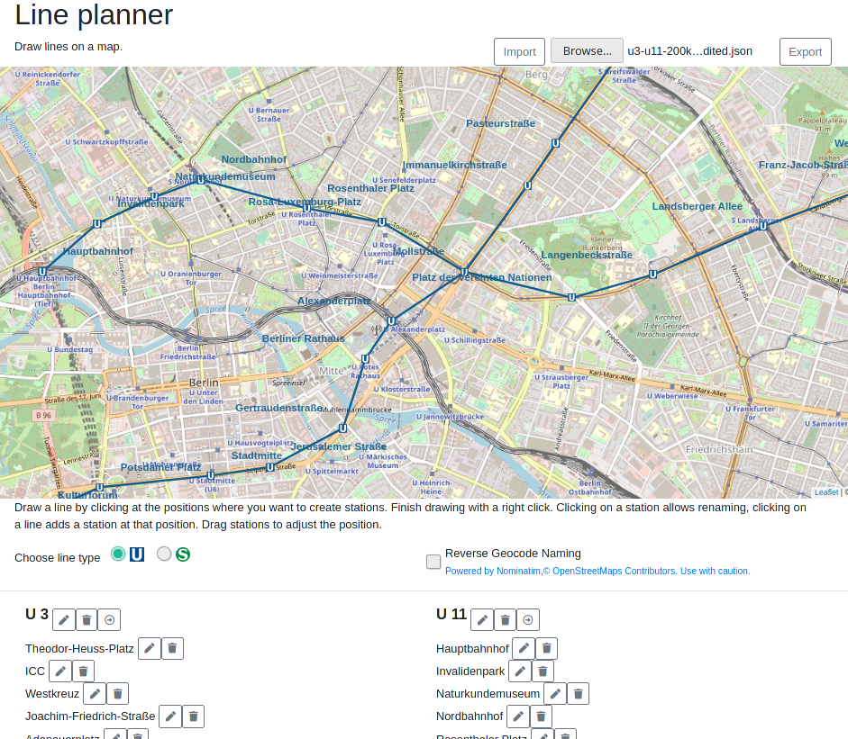

# line-planner

Line planner is a simple website that allows the planning of train lines (e.g. subway lines) on a map.

[Try it!](https://frcroth.github.io/line-planner/)  

### Features
- Create and edit lines on an open street map
- Create "U-Bahn" or "S-Bahn" lines
- Import and export created lines
- Automatically name stations via reverse geocode
