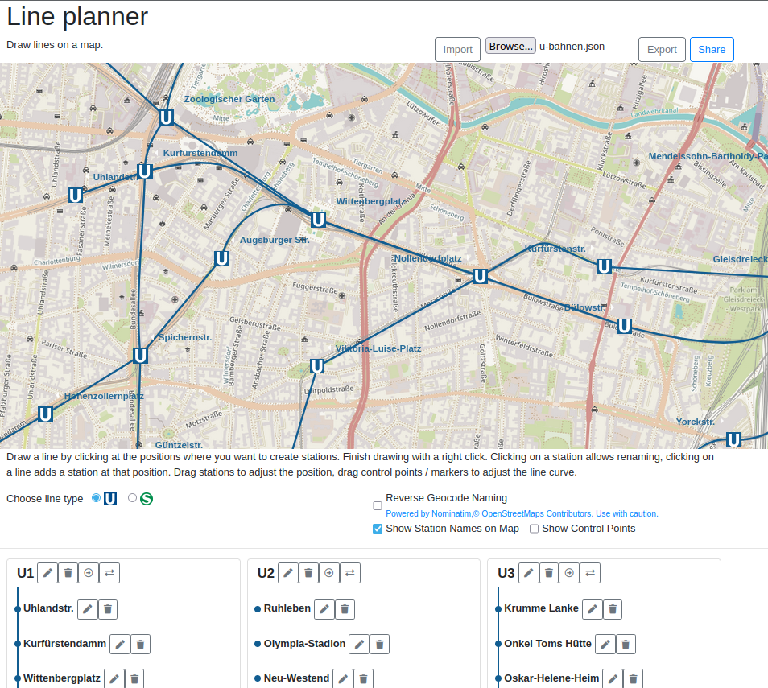

# line-planner

Line planner is a simple website that allows the planning of train lines (e.g. subway lines) on a map.

[Try it!](https://frcroth.github.io/line-planner/)  

Use an example file in the `examples` directory and import it using the import function!

### Features
- Create and edit lines on an open street map
- Line segments can be curves or straight
- Create "U-Bahn" or "S-Bahn" lines
- Import and export created lines, or share them via URL
- Automatically name stations via OSM reverse geocode or proximity to VBB stations
- Everything is undo and redoable
